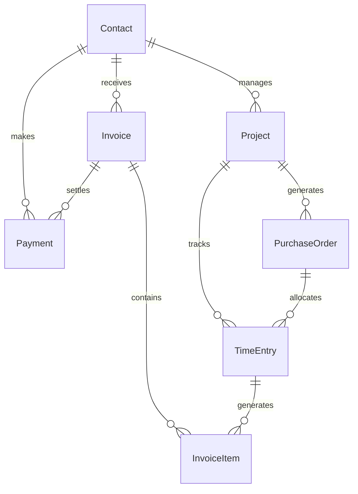

# Laravel ERP


A comprehensive, double-entry ERP system built on Laravel and the **Eloquent IFRS v5** library. Designed for Australian businesses with native Wise reconciliation, time tracking, and project management.

---

## Table of Contents

1. [Overview](#1-overview)
2. [Core Differentiators](#2-core-differentiators)
3. [Key Features](#3-key-features)
4. [Technology Stack](#4-technology-stack)
5. [Installation](#5-installation)
6. [Usage Overview](#6-usage-overview)
7. [Architecture Notes](#7-architecture-notes)
8. [Testing](#8-testing)
9. [Current Status & Roadmap](#9-current-status--roadmap)
10. [Contributing](#10-contributing)
11. [Security Vulnerabilities](#11-security-vulnerabilities)
12. [Support](#12-support)
13. [License](#13-license)
14. [Changelog](#14-changelog)

---

## 1. Overview

This ERP system provides a seamless workflow from **time tracking** and **purchase orders** to **invoicing** and **payment reconciliation**. It leverages the IFRS framework to ensure GAAP-compliant double-entry accounting out of the box.

## 2. Core Differentiators

- **Double-entry ledger** powered by **Eloquent IFRS v5**.
- Native **Wise Business Account** reconciliation (CSV + API).
- Full **time tracking → PO → invoice → payment** lifecycle.
- Pre-configured for **Australian GST** (10%) and July–June financial year.
- Role-based access: **Admin, Accountant, Staff, Client**.

## 3. Key Features

### 3.1 Accounting & Ledger

- Double-entry ledger system (IFRS compliant).
- Australian Chart of Accounts (pre-seeded).
- Tax handling (GST, GST_FREE, INPUT).
- Financial year configuration (July–June).

### 3.2 Contacts & Clients

- Manage clients, suppliers, and employees.
- Contact groups and segmentation.
- Address books and communication logs.

### 3.3 Wise Integration

- Sync Wise Business account transactions via API.
- CSV import for manual reconciliation.
- Match bank transactions to invoices/payments.

### 3.4 Projects & Time Tracking

- Create projects with assigned teams.
- Track time entries against projects and tasks.
- Approve timesheets and convert time to POs or invoices.

### 3.5 Purchase Orders

- Create POs from projects.
- Approve and convert POs to bills.
- Track receiving and inventory (basic).

### 3.6 Invoicing & Credit Notes

- Generate invoices from projects or time entries.
- Recurring invoices.
- Apply credit notes and adjustments.
- Email PDF invoices to clients.

### 3.7 Payments & Reconciliation

- Record incoming and outgoing payments.
- Match payments to invoices.
- Automated bank reconciliation (Wise).

### 3.8 Bills & Expenses

- Enter supplier bills.
- Track expenses and attach receipts.
- Bill approval workflow.

### 3.9 Reporting

- P&L, Balance Sheet, Trial Balance.
- GST reports (BAS-ready).
- Aging reports (AR/AP).
- Custom report builder (planned).

### 3.10 User Roles & Permissions

- Admin: Full system access.
- Accountant: Financial and reconciliation access.
- Staff: Time tracking, PO, and project access.
- Client: View invoices and projects (portal).

</details>

---

## 4. Technology Stack

- **Backend:** PHP 8.2+, Laravel 13.x
- **Accounting Core:** Eloquent IFRS v5
- **Database:** MySQL 8 / PostgreSQL 15
- **Frontend:** Laravel Blade, TailwindCSS, Alpine.js / Livewire (if applicable)
- **APIs:** Wise API, RESTful endpoints
- **Queue:** Redis / Database (for exports)

---

## 5. Installation

### Prerequisites

- PHP 8.2+
- Composer
- MySQL 8 / PostgreSQL 15
- Node.js & NPM (for asset compilation)

### Step-by-Step Setup

1. **Clone the repository:**
   
   ```bash
   git clone https://github.com/baradhili/laravel-erp.git
   cd laravel-erp
   ```

2. **Install PHP dependencies:**
   
   ```bash
   composer install
   ```

3. **Install and build frontend assets:**
   
   ```bash
   npm install
   npm run build
   ```

4. **Environment configuration:**
   
   ```bash
   cp .env.example .env
   php artisan key:generate
   ```
   
   Edit `.env` to set your database connection, timezone, and Wise API keys.

5. **Database setup (Migrate & Seed):**
   
   ```bash
   php artisan migrate --seed
   ```

6. **Storage link (for file uploads):**
   
   ```bash
   php artisan storage:link
   ```

7. **Start the development server:**
   
   ```bash
   php artisan serve
   ```

### Environment Variables Reference

| Variable                      | Description                            | Default            |
| ----------------------------- | -------------------------------------- | ------------------ |
| `APP_TIMEZONE`                | Application timezone                   | `Australia/Sydney` |
| `IFRS_BASE_CURRENCY`          | Base currency for accounting           | `AUD`              |
| `IFRS_REPORTING_PERIOD_START` | Financial year start date              | `YYYY-07-01`       |
| `WISE_API_TOKEN`              | Wise API authentication token          | (Required)         |
| `MAIL_*`                      | Mail configuration for invoice sending | (Set as needed)    |

---

## 6. Usage Overview

### Typical Workflow

1. **Create a Contact** (Client or Supplier).
2. **Start a Project** and assign a team.
3. **Track Time** against the project.
4. **Generate a Purchase Order** (if external costs are involved).
5. **Create an Invoice** from tracked time or project milestones.
6. **Receive Payments** via Wise or manual entry.
7. **Reconcile** transactions using the Wise CSV/API import.

---

## 7. Architecture Notes

### Core Entity Relationship

The system relies on the following key relationships:



### Models

- **Contact**: Clients, suppliers, and employees.
- **Project**: Container for work, POs, and time.
- **TimeEntry**: Logged hours, linked to projects and POs.
- **PurchaseOrder**: Authorized spending for a project.
- **Invoice**: Generated from time or fixed amounts.
- **Payment**: Cash inflow/outflow, linked to invoices.
- **Ledger (IFRS)**: Underlying double-entry accounts.

For deeper architectural details, see [docs/architecture.md](./docs/architecture.md).

---

## 8. Testing

Run the test suite to ensure everything is working correctly:

```bash
php artisan test
```

The suite covers:

- Unit tests for IFRS journal entries.
- Feature tests for invoice creation and reconciliation.

---

## 9. Current Status & Roadmap

| Phase   | Description                            | Status     |
| ------- | -------------------------------------- | ---------- |
| Phase 1 | Foundation & Accounting Core           | ✅ Complete |
| Phase 2 | Auth, Contacts & Wise Foundation       | ✅ Complete |
| Phase 3 | Time Tracking, Projects & POs          | ✅ Complete |
| Phase 4 | Invoices, Credit Notes & Payments      | ✅ Complete |
| Phase 5 | Bills, Expenses, Documents & Reporting | ✅ Complete |
| Phase 6 | Advanced Reconciliation & Automation   | ✅ Complete |

For the detailed task list (with checkboxes), please see the full **[Todo list](./todo-list.md)**.

---

## 10. Contributing

We welcome contributions! Please read our [CONTRIBUTING.md](./CONTRIBUTING.md) for details on our code of conduct, branching strategy, and pull request process.

---

## 11. Security Vulnerabilities

If you discover a security vulnerability within the ERP system - please raise a issue. All security vulnerabilities will be promptly addressed. 

---

## 12. Support

- **Issues & Bugs**: [GitHub Issues](https://github.com/baradhili/laravel-erp/issues)

---

## 13. License

**Disclaimer:** This software is provided "as is", without warranty of any kind. The authors are not liable for any damages arising from its use. Please ensure compliance with local tax laws and regulations when using this software.

---

## 14. Changelog

Please see the [CHANGELOG.md](./CHANGELOG.md) file for release notes and version history.
